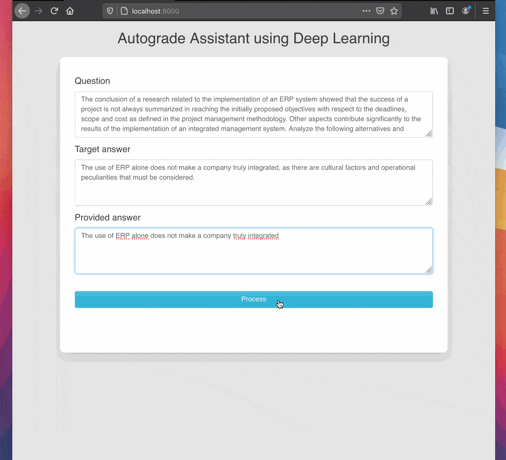

# Auto-grade Assistent using Deep Learning

This projects aims to implement a auto-grade assistant capable to give a score of "correctness" between a provided answer and a target answer.

At first glance, it is a **sentence similarity problem**, but it's harder because subtle changes between target and answer still give higher score similarity but may not be in agreement with the target answer. 

See the scores clicking in **Details** panel.

Fell invited to contribute to this project.

This simple web-app aims to quickly iterate with different target and answers.

## Impmentation Details

This implementation is using: 

* RoBERTa trained on MNLI task to give the entailment / contradiction score, provided by [fairseq](https://github.com/pytorch/fairseq/tree/master/examples/roberta).
* RoBERTa trained on sentence similarity, provided by [UPKLab Sentence Transformers](https://github.com/UKPLab/sentence-transformers).
* [Universal Sentence Encoder](https://tfhub.dev/google/universal-sentence-encoder-large/5) to provided sentence embeddings. 

## TO-DO list
As a start project, I have a to-do list to implement in future as:

* apply n-gram analysis 
* fine-tune the sentence-transformer model in more data like paws dataset.

## Demo 

## Installation

	# clone this repositort
	git clone https://github.com/renatoviolin/autograde.git

	
	# install python requirements
	pip install -r requirements.txt

	# start the flask server
	python3 app.py

	# navigate to your localhost:8000
